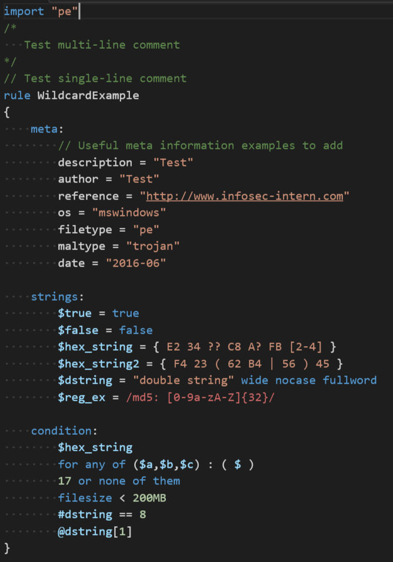

# textmate-yara
Syntax Highlighting, Diagnostics, and Snippets support for the YARA pattern matching language. A local copy of the YARA compiler, yarac, must be present on the system

## Snippets
* New file skeleton (or `rule:` skeleton)
* `meta:` section skeleton
* `strings:` section skeleton
* `condition:` section skeleton
* `import` statement
* `author` statement
* `description` statement
* `cve` statement
* `version` statement

## Extension Functionality
* Compile YARA rules using pre-compiled binaries in the user's $PATH
* Allow the user to compile YARA rules manually through VSCode commands
  * Use configuration settings to modify how command is run
* Display any compiler errors to the user through the VSCode workspace
  * Uses diagnostics already integrated into VSCode to display "squiggle" lines and right ruler

## How to get YARA binaries
* YARA is hosted on GitHub at [VirusTotal/yara](https://github.com/VirusTotal/yara/releases)
* Documentation for YARA is hosted at https://yara.readthedocs.io/

## Future Plans
* Execute YARA rules on one or more files at a time
  * Ideally, this will allow you to easily generate YARA rules that match similar files
* Include compatibility with Unix-based OSes from the get-go for the linter/intellisense, and YARA tools

## Problems?
If you encounter any issues, feel free to create an issue or pull request

## Screenshot

## References
#### Syntax Reference: 
https://yara.readthedocs.io/

#### TextMate Docs: 
http://manual.macromates.com/en/language_grammars

#### Regular Expressions: 
http://www.regular-expressions.info/modifiers.html

#### Other Code Inspirations: 
https://github.com/mmcgrana/textmate-clojure/blob/master/Syntaxes/Clojure.tmLanguage  
https://github.com/textmate/python.tmbundle/blob/master/Syntaxes/Python.tmLanguage  
https://github.com/nyx0/YaraSyntax/blob/master/yara.tmLanguage  
https://github.com/blacktop/language-yara
